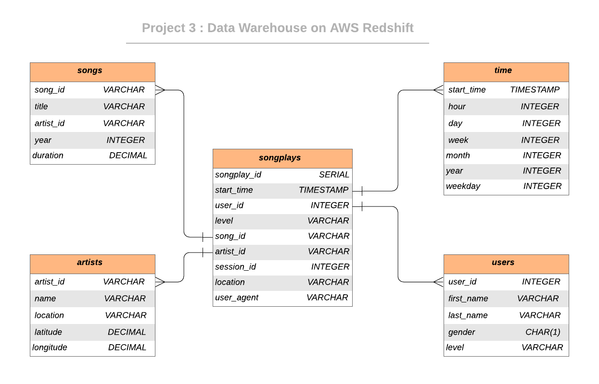

# Data Warehousing with Redshift

In this project I built an ETL pipeline that extracts data from AWS S3, stages them in AWS Redshift, and transforms data into a set of dimensional tables for analytics, then I created a dashboard using Power BI

## Database Schema
The data consists of 5 tables. This design focuses on the songplay table (fact table).  The dimensional tables are time, users, songs, and artists help to provide context and additional details for the songplay table.

There are two staging tables **staging_events** and the **staging_songs** tables.  These tables are to temporally hold data from the S3 Bucket before being transformed and inserted into the primary use tables.

 The **staging_songs** table contains:

 | Field           | Data Type          |
  |-------------  | -------------         |
 | artist_id            | VARCHAR                    |
 | artist_latitude   | DECIMAL                   |
 | artist_location  | VARCHAR                 |
 | artist_longitude | DECIMAL                  |
 | artist_name        | VARCHAR                 |
 | duration              | DECIMAL                  |
 | num_songs         | INTEGER                   |
 | song_id               | VARCHAR                |
 | title                     | VARCHAR                 |
 | year                    | INTEGER                 |

  The **staging_events** table contains:

  | Field           | Data Type          |
   |-------------  | -------------         |
  | artist             | VARCHAR                    |
  | auth     | VARCHAR                  |
  | firstName  | VARCHAR                 |
  | gender | CHAR(1)                  |
  | itemInSession       | INTEGER                 |
  | lastName        | VARCHAR                 |
  | length            | DECIMAL                  |
  | level          | VARCHAR                |
  | location              | VARCHAR                |
  | method                    | VARCHAR                |
  | page                  | VARCHAR                 |
  | registration           | FLOAT                  |
  | sessionId          | INTEGER                   |
  | song              | VARCHAR                |
  | status                     | INTEGER            |
  | ts                  | VARCHAR               |
  | userAgent                     | VARCHAR  |
  | userId                 | INTEGER                 |

The use tables are the **songplay_fact**, **time_dim**, **user_dim**, **song_dim**, and **artist_dim** tables.  These tables are in the

 The **time table** which contains:

 | Field        | Data Type          | Key       | KEYDIST |
  |-------------  | ------------- | ------------- | ------------- |
 | start_time      | TIMESTAMP | Primary | SORTKEY |
 | hour      | INTEGER     |    | |
 | day | NUMERIC      |     | |
 | week | NUMERIC      |     | |
 | month | NUMERIC      |     | |
 | year | NUMERIC     |     | |
 | weekday | NUMERIC     |     | |

 The **users table** which contains:

 | Field        | Data Type          | Key  | KEYDIST |
 | ------------- | ------------- |  ------------- | ------------- |
 | user_id      | INTEGER | Primary | SORTKEY |
 | first_name      | VARCHAR      |    | |
 | last_name | VARCHAR      |     | |
 | gender | CHAR(1)      |     | |
 | level | VARCHAR     |     | |

 The **songs table** which contains:

 | Field        | Data Type          | Key  | KEYDIST |
 | ------------- | ------------- |  ------------- | ------------- |
 | song_id      | VARCHAR | Primary | SORTKEY |
 | title      | VARCHAR      |    | |
 | artist_id | VARCHAR      |  Foreign Key   | |
 | year | INTEGER      |     | |
 | duration | DECIMAL     |     | |

 The **artists table** which contains:

 | Field        | Data Type          | Key  | KEYDIST |
 | ------------- | ------------- |  ------------- | ------------- |
 | artist_id      | VARCHAR | Primary | DISTKEY |
 | name      | VARCHAR      |    | |
 | location | VARCHAR      |    | |
 | latitude | DECIMAL      |     | |
 | longitude | DECIMAL   |     | |

 The **songplay table** which contains:

 | Field        | Data Type          | Key  | KEYDIST |
 | ------------- | ------------- |  ------------- | ------------- |
 | songplay_id      | INTEGER | Primary | |
 | start_time      | TIMESTAMP    |  Foreign Key  | SORTKEY |
 | user_id | INTEGER  |  Foreign Key   | |
 | song_id | VARCHAR      |  Foreign Key   | |
 | artist_id | VARCHAR     |  Foreign Key   | |
 | session_id | INTEGER  |     | |
 | location | VARCHAR      |     | |
 | user_agent | VARCHAR     |     | |

## File Description

- **dwh.cfg:**
This is the configuration file that stores aws key, aws secrets, details about the aws cluster, IAM role and the location of data in S3. Before you start the project you need to set these configurations with your AWS credentials .
- **sql_queries.py:**
This file contains the all sql queries used to create tables in Redshift and ETL data from the S3 Bucket into the staging table and then insert data from the staging table into the data warehouse tables.
- **create_redshift_cluster.py:**
This file is used to connect to aws and create the Redshift cluster. **Remember** before running this file the aws key and secret and Redshift cluster details must be added to the `dwh.cfg` file. **Important Note** you don't have to set IAM Role `arn` and cluster `host` in the configuration file as by running `create_redshift_cluster.py` file, it will set them automatically after the cluster is created. 
- **create_tables.py:**
This file is used to delete all tables from the cluster, then create the staging and data warehouse tables in Redshift cluster. It will import the create table queries from the sql_queries.py to do that.
- **etl.py:**
This file is used to transfer data from S3 Buckets to staging tables and then to insert data from the staging tables into the data warehouse tables. This file will import the copy and insert commands from the sql_queries.py script.
- **destroy_redshift_cluster:**
Finally, we need to delete the Redshift cluster to avoid excessive charges. this is the role of this file.

## Project Execution

1. First step as mentioned above you must put your credentials in the configurations file `dwh.cfg`, you have to set them all except `arn` and `host` those will done by running `create_redshift_cluster.py` file.
2. Second step is to create the Redshift cluster by running `create_redshift_cluster.py` file by typing `python create_redshift_cluster.py` command in the command line.
3. Third step is to create the staging and data warehouse tables, and this will done by running `create_tables.py` file by typing `python create_tables.py` command in the command line.
4. Forth step is copy the data from the S3 bucket to the staging tables and transform them into the data warehouse tables. `etl.py` file will do this for you after typing `python etl.py` command in the command line.
5. Fifth step is to connect on this Redshift data warehouse and build an analytics dashboard, you can find the dashboard [here](/dashboard/).
6. Sixth and last step, we need to delete the Redshift cluster to avoid excessive charges, and this is what [destroy_redshift_cluster](/destroy_redshift_cluster.py/) will do. To execute this file use `python destroy_redshift_cluster.py` command 
